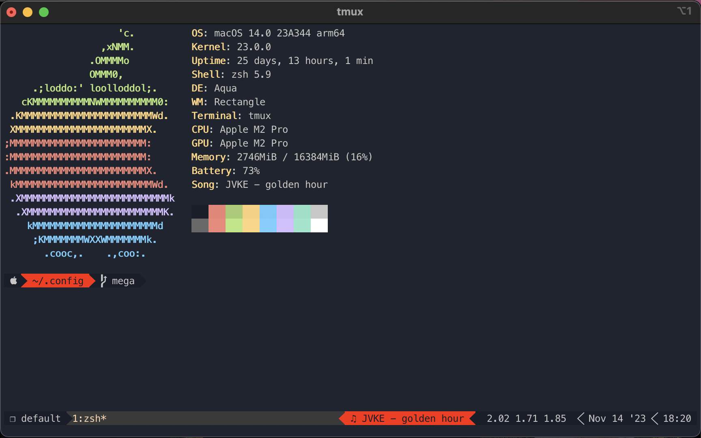
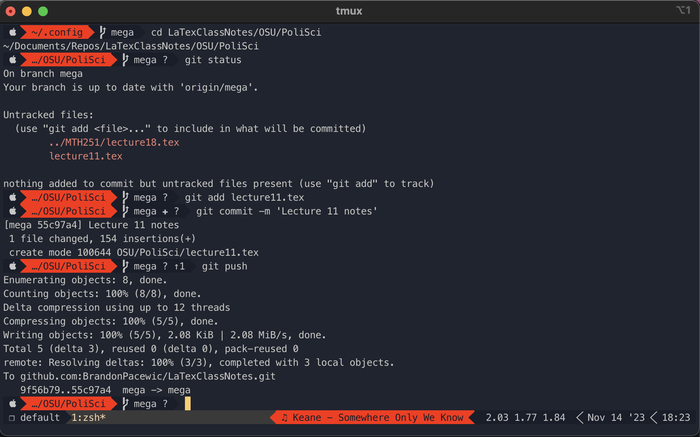
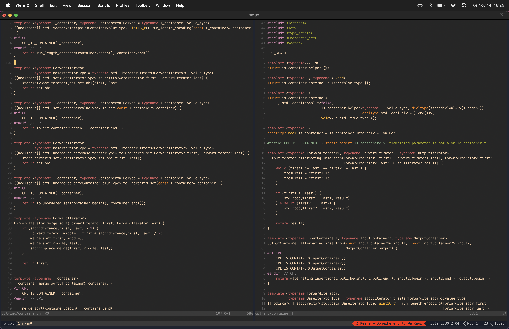

# .config

My OSX config files.

<p align="center">
    
    
</p>



## Installing

```
git clone git@github.com:BrandonPacewic/.config.git
cd .config/
sudo ./install.sh
```

## License

Copyright (c) Brandon Pacewic

SPDX-License-Identifier: MIT
